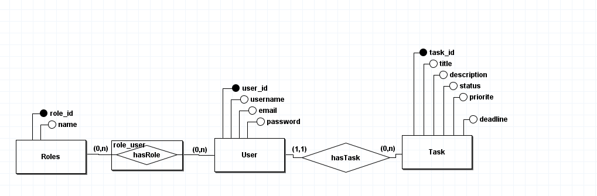
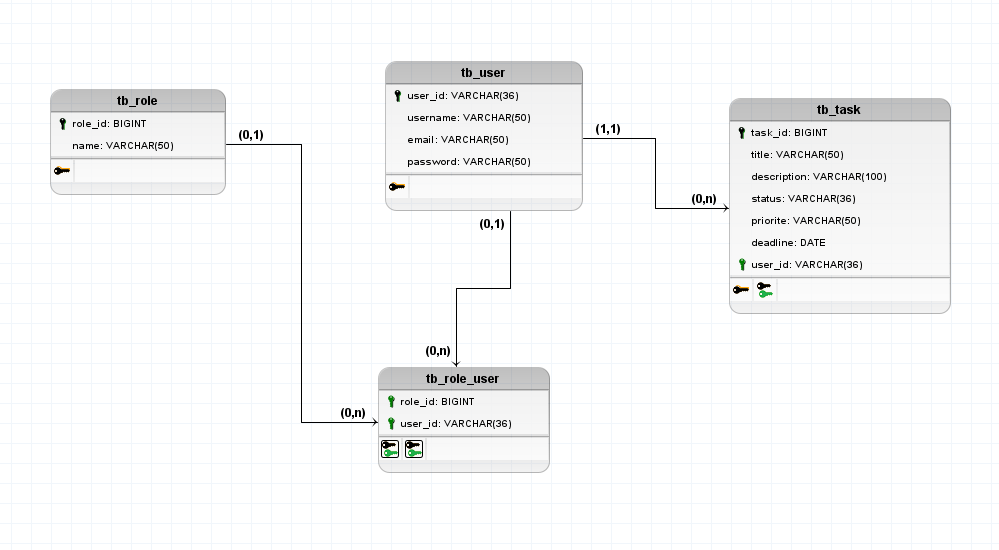

<!-- o que faz?
com que o que foi construido?
e por que foi construido? -->


# TaskGT


<!-- desc -->
TaskGt is a task manager designed to provide an intuitive and versatile experience. It allows users to create, customize, and track their tasks easily, helping them stay organized and boost their productivity.
The main goal of this project is to offer an efficient tool for managing daily routines with simplicity and effectiveness.


## 🗂️ Conceptual Model

The image below shows the conceptual model of the TaskGt project, illustrating the entities and their relationships within the system.




## 🗂️ Logic Model

The image below shows the logic model of the TaskGt project, illustrating the tables and their attributes.




<!-- ## 🚀 Começando


usar o ``` bash comando``` 


### 📋 Pré-requisitos

### 🔧 Instalação

## ⚙️ Executando os testes/Instrucoes de uso  

### ⌨️ E testes de estilo de codificação -->

## ✒️ Author

- [Matheus Lustosa](https://github.com/SEU_USUARIO)


<!-- ## 📄 Licença -->

<!-- ## Contributing -->


